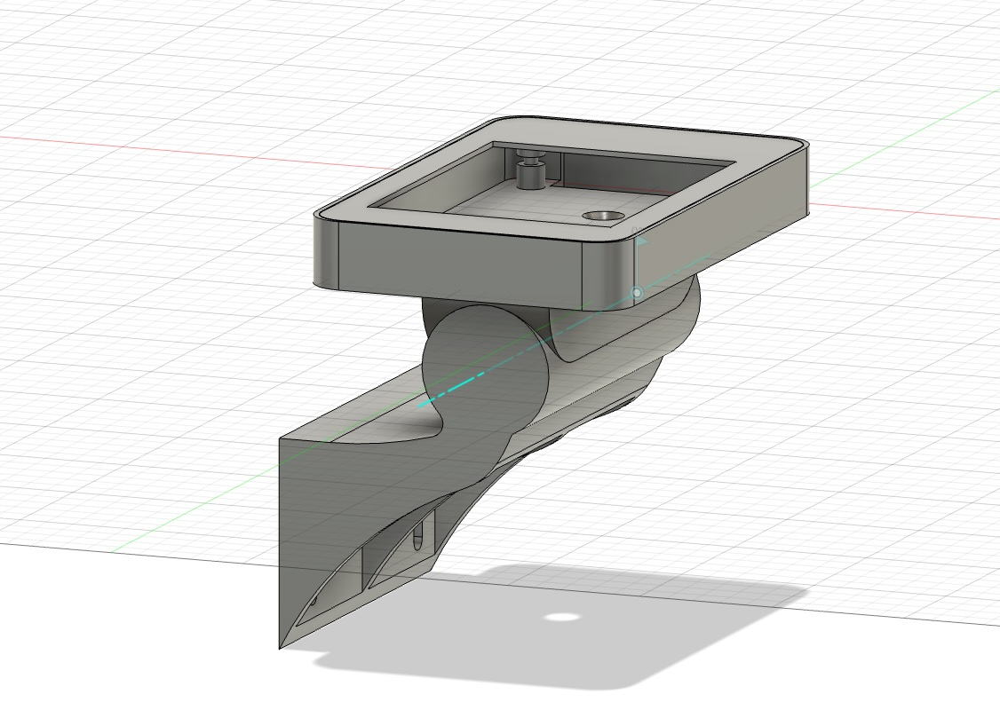
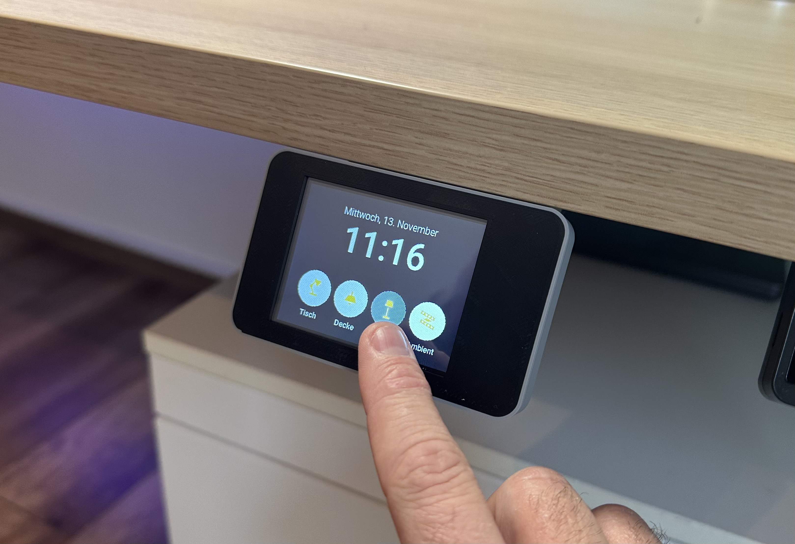
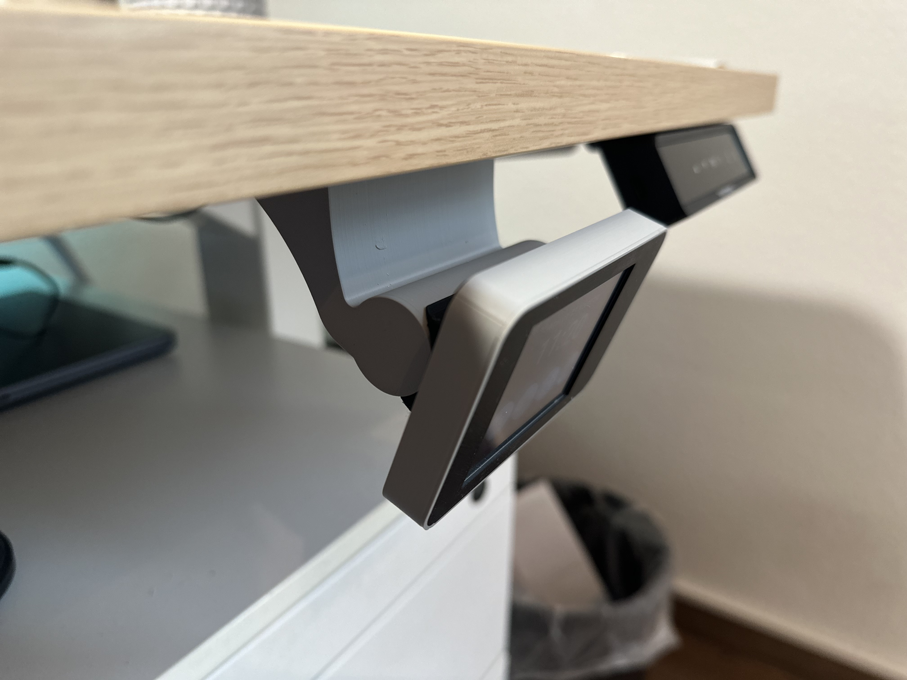
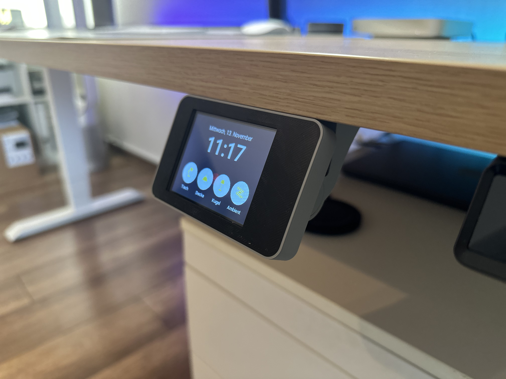
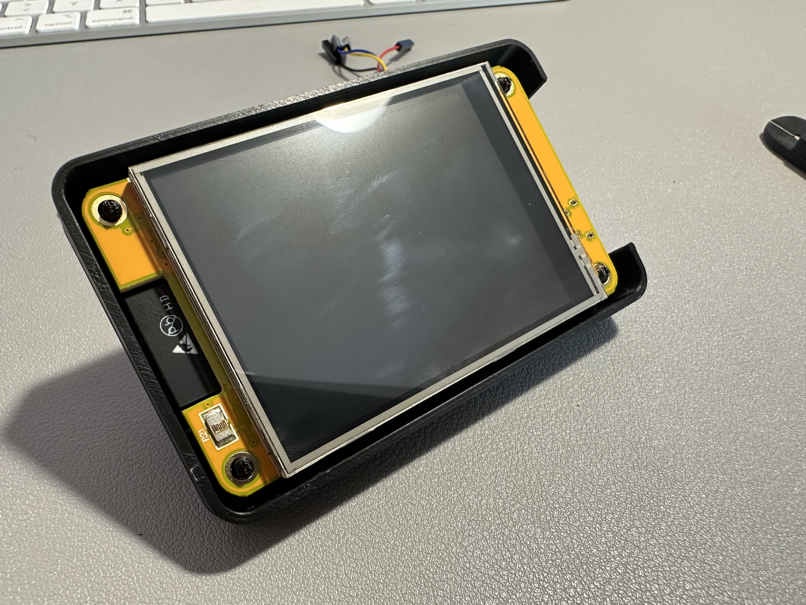
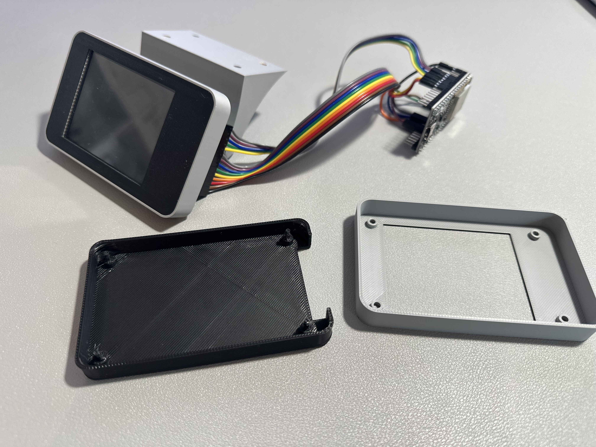
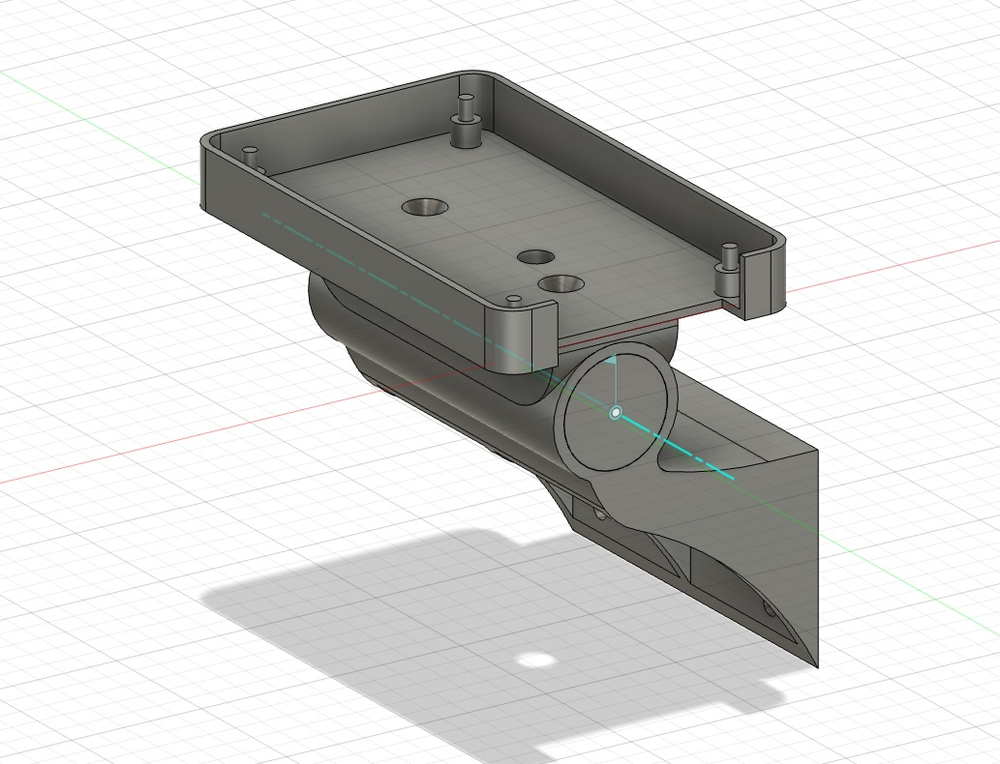
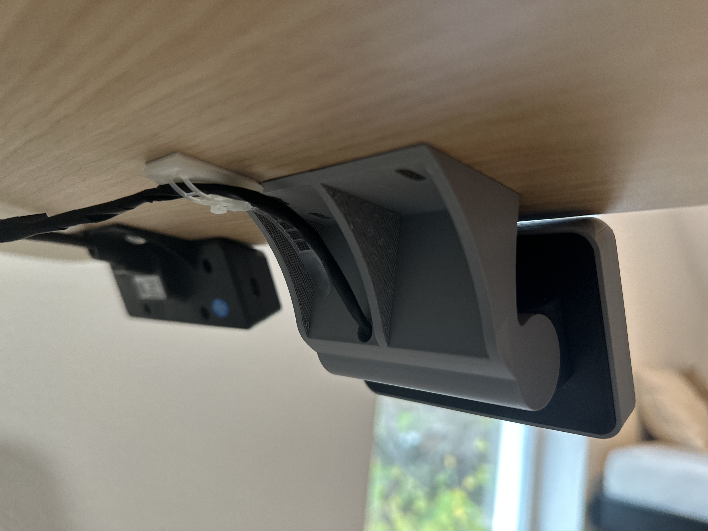

# 2.8" ILI9341 Touch Display Enclosure for ESP32 with Home Assistant Integration

This project provides ESPHome config files and 3D-printable files for an enclosure designed to house a 2.8" ILI9341 touch display. Compatible with standalone 2.8" ILI9341 touch display connected to an ESP32 board or using the ESP32-2432S028 (integrating an ESP32 Wroom module and ILI9341 display on one board), this setup serves as an external, touchscreen-enabled display for your Home Assistant environment.

The enclosure is designed for mounting beneath a desk and includes a swivel joint, allowing for easy adjustments to the viewing angle while keeping all cables neatly concealed for a clean, streamlined look. The touchscreen offers multiple customizable buttons linked to Home Assistant automations, making it easy to control functions such as lighting—and you’re free to create additional buttons as desired.

The joint supports an adjustable tilt of +/- 35 degrees up and down. The display’s positioning tension can be fine-tuned by adjusting the screw tightness. The screw hole is deliberately sized slightly smaller than the M4 screw, requiring a bit of force during insertion to ensure a secure hold that prevents any looseness.

Simply print the files and flash the firmware to the ESP using ESPHome, connect it to Home Assistant.

The images show the version with an ESP32-2432S028. I recommend using the ESP32-2432S028 as its just the power cable you need to pass-thru into the case and everything else is hidden. Down below you'll find some images of the ILI9341 display with an external ESP32.

### Features:

- Customizable 3D-printed enclosure with hidden cable design for a clean setup
- Swivel joint for adjustable viewing angles
- Supports 2.8" ILI9341 touch display, compatible with ESP32 or ESP32-2432S028 (includes ESP32 Wroom and display on one board)
- Connect to Home Assistant compatibility to control automations such as lighting
- Using [ESPHome](https://www.esphome.io) which makes it easy to code and modify for your needs

## Parts needed

| Part                         | Price   | Comment                                         |
|------------------------------|---------|-------------------------------------------------|
| ESP32-2432S028			   | 15$     | 2.8" ILI9341 with integrated ESP                |
| 2x M4 3.5x16 screw (flathead)| 0.10$   | Screws to connect the mount case with the base  |

or

| Part                         | Price   | Comment                                         |
|------------------------------|---------|-------------------------------------------------|
| 2.8" ILI9341    			   | 8$      | 2.8" ILI9341                                    |
| ESP32 Wroom 32D   		   | 8$      | or some ESP32                                   |
| 2x M4 3.5x16 screw (flathead)| 0.10$   | Screws to connect the mount case with the base  |

## How
- Flash your ESP32 via ESPHome and use the yaml from the esphome folder. Adjust to your needs
- Print the parts. 
- Use two M4 screws to attach the display case and the base
- *Connect all pins (when using a solo display with an ESP32)

## HomeAssistant
- Create some automations in home assistant using the exposed buttons as trigger.
 
 
 
# Options

## a) Using an ESP32-2432S028
Simply connect to USB and flash the ESP using the yml file in the esphome directory. If your board is designed different check the pin layout

| ESP32-2432S028               | PIN          | Comment                                              |
|------------------------------|--------------|------------------------------------------------------|
| LCD                          |              |                                                      |
| clk_pin                      | GPIO14       | SPI LCD Clock                                        |
| mosi_pin                     | GPIO13       | SPI LCD MOSI (sometimes also labeled as SDI)         |
| miso_pin   	    		   | GPIO12       | SPI LCD MISO (sometimes also labeled as SDO	         |
| cs_pin                       | GPIO15       | Display CS                                           |
| dc_pin                       | GPIO2        | Display DC                                           |
| Touchscreen                  |              |                                                      |
| clk_pin                      | GPIO25       | SPI Touchscreen Clock                                |
| mosi_pin                     | GPIO32       | SPI Touchscreen MOSI (sometimes also labeled as DIN) |
| miso_pin                     | GPIO39       | SPI Touchscreen MISO (sometimes also labeled as DO)  |
| cs_pin                       | GPIO33       | Touchscreen CS                                       |
| interrupt_pin                | GPIO36       | Touchscreen Interrupt                                |
| LED                          |              |                                                      |
| ledc                         | GPIO21       | Backlight LED display                                |
| ledc                         | GPIO4        | Onboard LED (not used for this project)              |

To power the device, use the VIN and GND pins from the JST port (typically provided with a JST-to-pin cable). Pass the cable through the case using the hole in the center which runs through the swivel joint and connect these ends to the 5V and GND wires of an old USB cable

## b) Using an 2.8" ILI9141 standalone connected to an ESP32 Wroom 32D
Follow the connection diagram, which shows how to put everything together.

| ILI9341                      | PIN  ESP32   | Comment                                              |
|------------------------------|--------------|------------------------------------------------------|
| GND                          | GND          | Ground                                               |
| VCC                          | 3.3V         | Power                                                |
| LCD                          |              |                                                      |
| SCK                          | GPIO18       | SPI LCD Clock                                        |
| SDI (MOSI)                   | GPIO23       | SPI LCD MOSI (sometimes also labeled as SDI)         |
| SDOK (MISO)   	    	   | GPIO19       | SPI LCD MISO (sometimes also labeled as SDO	         |
| CS                           | GPIO27       | Display CS                                           |
| D/C                          | GPIO26       | Display DC                                           |
| RESET                        | GPI16        | Display Reset                                        |
| Touchscreen                  |              |                                                      |
| T_CLK                        | GPIO25       | SPI Touchscreen Clock                                |
| T_DO                         | GPIO35       | SPI Touchscreen MOSI (sometimes also labeled as DIN) |
| T_DIN                        | GPIO32       | SPI Touchscreen MISO (sometimes also labeled as DO)  |
| T_CS                         | GPIO33       | Touchscreen CS                                       |
| T_IRQ                        | GPIO34       | Touchscreen Interrupt                                |
| LED                          |              |                                                      |
| ledc                         | GPIO4        | Backlight LED display                                |

## 3D Print
See folder print to get all SLT files and the fusion360 file. Feel free to adjust and remix

# DISCLAIMER
This project is to be considered as a work in progress. 
Feel free to adjust and remix the 3D cover to your needs. Its designed in Fusion 360, see fusion 360 file in the 3d_print folder.

# Other

